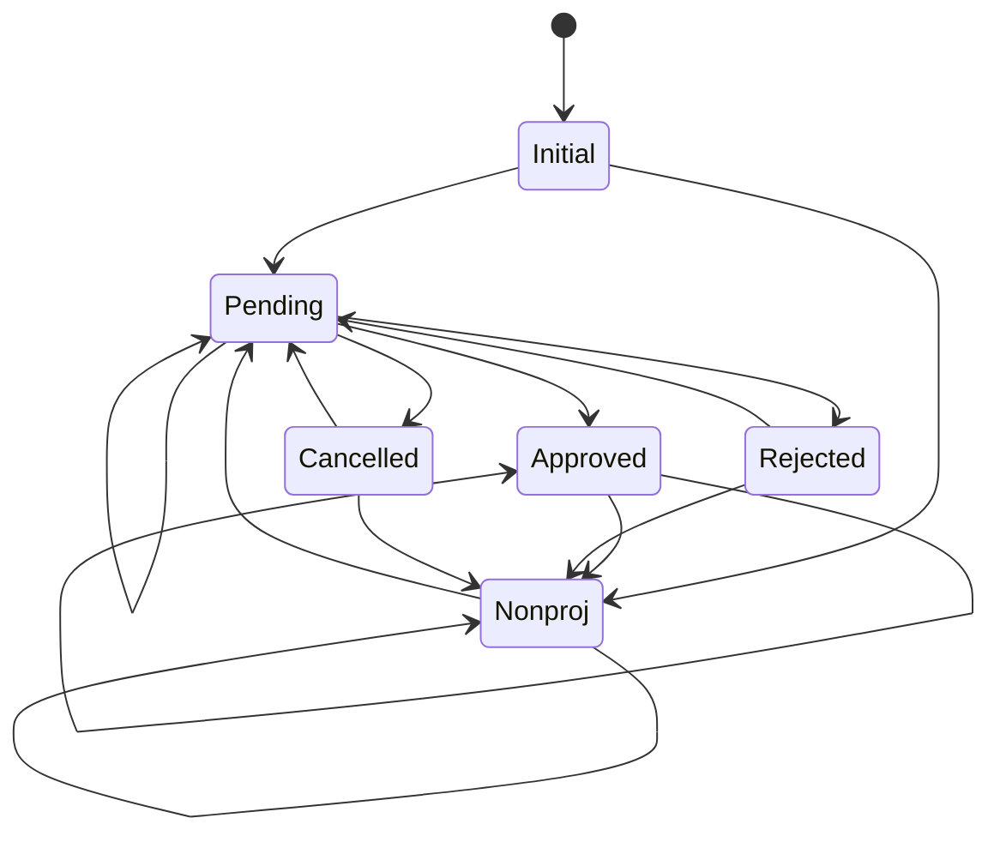

<!-- Heading -->

# Heading 1

## Heading 2

### Heading 3

#### Heading 4

##### Heading 5

###### Heading 6

<!-- Italics -->

*This is* Italics
_This Is_ Italics

<!-- Strong -->

**This is** Strong
__This is__ Strong

<!-- Strikethorugh -->

~~This is~~ strikethorugh

<!-- Horizontal Rule -->

---

<!-- Blockquote -->

> This is blockquote

<!-- Links -->

[This is link](http://goolge.com)

[This is title link](http://goolge.com "this is title")

<!-- UList -->

* List 1
* list 2
  * Nested Item
    * Nested Item

<!-- OList -->

1. Item 1
2. Item 2
3. Item 3

<!-- Inline Codes -->

`<p>This is a paragraph</p>`

<!-- Images -->


<!-- Github Markdown -->

```
npm install

npm start

```

```bash
mkdir 
touch new.txt
```

```go
func main(){
  fmt.Println("hello world")

}
```

```C++
void main(){
cout<<"hello world";
}
```

<!-- Table -->

| Name     | Email   |
| -------- | ------- |
| Jayanti  | mailId  |
| Jayanti2 | mailId2 |

<!-- Task Lists -->

* [X] Task1
* [X] Task2

* [] Task3

>Resource LinK: [Mermaid](https://mermaid.js.org/syntax/stateDiagram.html)
<br>

>State Diagram

> State Flow Diagram 
```mermaid
flowchart TB

P[pending]
NP[NA Proj - \ninitial-nonproj or \n nonproj-nonproj]
SP[Same/Diff Proj-pending \n or initial-pending]
I-->|create|P
I-->|create|N
P --> |update|P
P -->|reject|R
P -->|cancel|C
P -->|approve|A
DF[Diff project]
P --> DF --> I
N-->|update|N
N-->|edit|P
A-->|approve|A
C--> |create|SP
C --> |create or update|NP
R --> |create or update|NP
R --> |create|SP -->I

C[cancelled]
I[initial]
N[nonproj]
A[approved]
R[rejected] 

